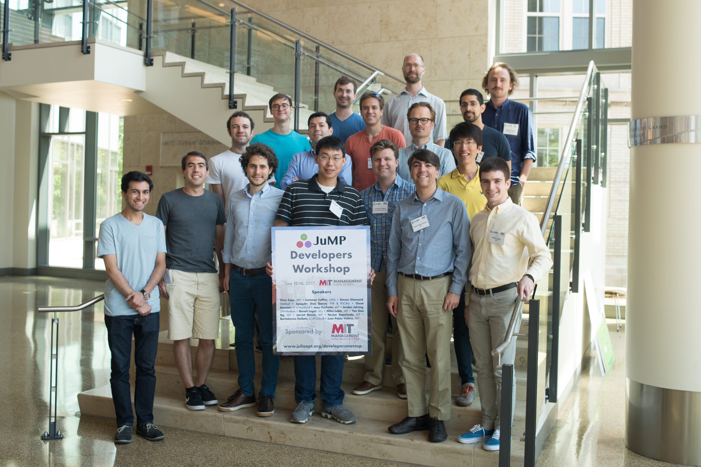

# JuMP Developers Meetup/Workshop

June 12-16, 2017, at Sloan School of Business, Massachusetts Institute of Technology

The meetup/workshop was sponsored by the <a href="http://mitsloan.mit.edu/office-of-international-programs/mit-sloan-latin-america-office/">MIT Sloan Latin America Office</a>.

## Purpose

The meetup is designed to serve as an opportunity for developers of mathematical optimization software within the JuMP "stack" (i.e., solvers, solver interfaces, MathProgBase, JuMP, and JuMP extensions) to meet and focus on advancing common interests. JuMP core developers will present on the internals of JuMP and solicit feedback in preparation for the release of JuMP 1.0 (targeted for July, 2017). Attendees are welcome to contribute to the JuMP stack itself or to pursue JuMP-related projects while having the JuMP developers in the same room for questions and feedback.

## Locations

On Monday morning until the lunch break, Tuesday all day, and Wednesday all day, the meetup will take place
in the room <a href="http://whereis.mit.edu/?go=E62">E62-223</a>. This is on the second floor of the
main building of MIT Sloan.

Thursday all day and Friday all day, the meetup will take place in the room
<a href="http://whereis.mit.edu/?go=E52">E62-650</a>. This is on the sixth floow of the main building of MIT Sloan.

## Schedule

### Monday June 12

Room <a href="http://whereis.mit.edu/?go=E62">E62-223</a> (until lunch)

<a href="https://www.timeanddate.com/worldclock/fixedtime.html?iso=20170612T0900&msg=Welcome+and+Introduction&p1=43&am=30"><tt>09:00</tt></a> Welcome and Introduction (**Juan Pablo Vielma**, MIT) [[Slides](vielma.pdf)]

<a href="https://www.timeanddate.com/worldclock/fixedtime.html?iso=20170612T0930&msg=The+design+of+JuMP+and+MathProgBase&p1=43&ah=1"><tt>09:30</tt></a> *The design of JuMP and MathProgBase* (**Miles Lubin**, MIT) [[Slides](lubin.pdf)]

<a href="https://www.timeanddate.com/worldclock/fixedtime.html?iso=20170612T1030&msg=The+design+and+architecture+of+Pajarito&p1=43&am=30"><tt>10:30</tt></a> *The design and architecture of <a href="https://github.com/JuliaOpt/Pajarito.jl">Pajarito</a>* (**Chris Coey**, MIT) [[Slides](coey.pdf)]

<a href="https://www.timeanddate.com/worldclock/fixedtime.html?iso=20170612T1100&msg=Coffee+break+and+group+photo&p1=43&am=45"><tt>11:00</tt></a> Coffee break and group photo

<a href="https://www.timeanddate.com/worldclock/fixedtime.html?iso=20170612T1145&msg=A+talk+on+cvxflow&p1=43&am=45"><tt>11:45</tt></a> *A Graph-Based Architecture for Optimization Modeling Frameworks* (**Steven Diamond**, Stanford)

<tt>12:15</tt> Lunch break

Room <a href="http://whereis.mit.edu/?go=E51">E51-376</a> (after lunch)

<a href="https://www.timeanddate.com/worldclock/fixedtime.html?iso=20170612T1430&msg=Plans+and+priorities+for+JuMP+1.0+and+MathProgBase+1.0&p1=43&am=30"><tt>14:30</tt></a> *Plans and priorities for JuMP 1.0 and MathProgBase 1.0* (**Miles Lubin**)

<a href="https://www.timeanddate.com/worldclock/fixedtime.html?iso=20170612T1500&msg=Discussion+and+feedback+on+JuMP+1.0+and+MathProgBase+1.0&p1=43&ah=2"><tt>15:00</tt></a> Discussion and feedback on JuMP 1.0 and MathProgBase 1.0, discuss important issues including <a href="https://github.com/JuliaOpt/MathProgBase.jl/issues/164">MathProgBase issue #164</a> on solver statuses and <a href="https://github.com/JuliaOpt/MathProgBase.jl/issues/168">MathProgBase issue #168</a> on a new standard problem format

<tt>17:00</tt> Finish

### Tuesday June 13

Room <a href="http://whereis.mit.edu/?go=E62">E62-223</a> (all day)

<a href="https://www.timeanddate.com/worldclock/fixedtime.html?iso=20170613T0910&msg=Welcome+for+the+day&p1=43&am=5"><tt>09:10</tt></a> Welcome for the day

<a href="https://www.timeanddate.com/worldclock/fixedtime.html?iso=20170613T0915&msg=A+talk+on+sum-of-squares+optimization+in+Julia&p1=43&am=30"><tt>09:15</tt></a> *Sum-of-squares optimization in Julia* [remote presentation] (**Benoît Legat**, Université Catholique de Louvain) [[Slides](legat.pdf)]

<a href="https://www.timeanddate.com/worldclock/fixedtime.html?iso=20170613T0945&msg=Reference+Implementations+for+R%26D+in+Power+Network+Optimization&p1=43&am=30"><tt>09:45</tt></a> *<a href="https://github.com/lanl-ansi/PowerModels.jl">PowerModels.jl</a>: Reference Implementations for R&D in Power Network Optimization* (**Carleton Coffrin**, Los Alamos National Lab) [[Slides](coffrin.pdf)]

<a href="https://www.timeanddate.com/worldclock/fixedtime.html?iso=20170613T1015&msg=Coffee+break&p1=43&am=30"><tt>10:15</tt></a> Coffee break

<a href="https://www.timeanddate.com/worldclock/fixedtime.html?iso=20170613T1045&msg=Stochastic+programming+in+energy+systems&p1=43&am=30"><tt>10:45</tt></a> *Stochastic programming in energy systems* (**Joaquim Dias Garcia**, PSR and PUC-Rio) [[Slides](dias.pdf)]

<a href="https://www.timeanddate.com/worldclock/fixedtime.html?iso=20170613T1115&msg=Graph-based+modeling+using+JuMP&p1=43&am=30"><tt>11:15</tt></a> *Graph-based modeling using JuMP* (**Jordan Jalving**, UW-Madison) [[Slides](jalving.pdf)]

<a href="https://www.timeanddate.com/worldclock/fixedtime.html?iso=20170613T1145&msg=Decarbonization+of+power+systems+using+JuMP&p1=43&am=30"><tt>11:45</tt></a> *Decarbonization of power systems using JuMP* (**Nestor Sepulveda**, MIT)

<tt>12:15</tt> Lunch break

<a href="https://www.timeanddate.com/worldclock/fixedtime.html?iso=20170613T1400&msg=Working+with+JuMP’s+macros+for+extensions&p1=43&am=30"><tt>14:00</tt></a> *Working with JuMP’s macros for extensions* (**Yee Sian Ng**, MIT) [[Notebook](http://nbviewer.jupyter.org/url/www.juliaopt.org/developersmeetup/ng.ipynb)]

<a href="https://www.timeanddate.com/worldclock/fixedtime.html?iso=20170613T1430&msg=Solving+optimization+problems+containing+piecewise+linear+functions&p1=43&am=30"><tt>14:30</tt></a> *<a href="https://github.com/joehuchette/PiecewiseLinearOpt.jl">PiecewiseLinearOpt.jl</a>: Solving optimization problems containing piecewise linear functions* (**Joey Huchette**, MIT) [[Slides](huchette.pdf)]

<a href="https://www.timeanddate.com/worldclock/fixedtime.html?iso=20170613T1500&msg=A+Julia+wrapper+and+extensions+for+the+Operator+Splitting+QP+solver&p1=43&am=30"><tt>15:00</tt></a> *OSQP.jl: A Julia wrapper and extensions for the Operator Splitting QP solver* (**Bartolomeo Stellato**, Oxford) [[Slides](stellato.pdf)]

<a href="https://www.timeanddate.com/worldclock/fixedtime.html?iso=20170613T1530&msg=A+talk+on+SolverStudio+%2B+Julia&p1=43&am=30"><tt>15:30</tt></a> *<a href="https://solverstudio.org/">SolverStudio</a> + Julia* (**Oscar Dowson**, University of Auckland)

<tt>16:00</tt> Finish

### Wednesday June 14

Room <a href="http://whereis.mit.edu/?go=E62">E62-223</a> (all day)

<a href="https://www.timeanddate.com/worldclock/fixedtime.html?iso=20170614T0900&msg=Tutorial+and+live+coding+with+Documenter.jl&p1=43&ah=2"><tt>09:00</tt></a> Tutorial and live coding with Documenter.jl

<a href="https://www.timeanddate.com/worldclock/fixedtime.html?iso=20170614T0900&msg=A+talk+on+automatic+differentiation&p1=43&am=45"><tt>11:00</tt></a> *A talk on automatic differentiation using <a href="https://github.com/JuliaDiff/ForwardDiff.jl">ForwardDiff.jl</a> and <a href="https://github.com/JuliaDiff/ReverseDiff.jl">ReverseDiff.jl</a>* (**Jarrett Revels**, MIT)

<tt>11:45</tt> Lunch break

<tt>14:00</tt> Developer collaboration

<tt>17:00</tt> Finish

### Thursday June 15

Room <a href="http://whereis.mit.edu/?go=E62">E62-650</a> (all day) **Updated**

<tt>09:00</tt> Developer collaboration, brainstorming on JuMP's containers (<a href="https://github.com/JuliaOpt/JuMP.jl/issues/1047">JuMP issue #1047</a>)

<tt>12:00</tt> Lunch break

<tt>14:00</tt> Developer collaboration, brainstorming on solver callbacks (<a href="https://github.com/JuliaOpt/MathProgBase.jl/issues/170">MathProgBase issue #170</a>)

<tt>16:00</tt> Finish

<tt>18:00</tt> Meetup dinner

### Friday June 16

<tt>10:00</tt> Tour of the MIT Museum (meet at <a href="https://goo.gl/maps/Ea3877tcMZ42">265 Massachusetts Avenue, Cambridge</a>)

<tt>11:30</tt> Lunch break

Room <a href="http://whereis.mit.edu/?go=E62">E62-650</a> **Updated**

<tt>14:00</tt> Developer collaboration, brainstorming on the future of algebraic modeling languages (**Chris Coey**)

<tt>17:00</tt> Finish

## Contact

Contact mlubin at mit.edu for more information.
