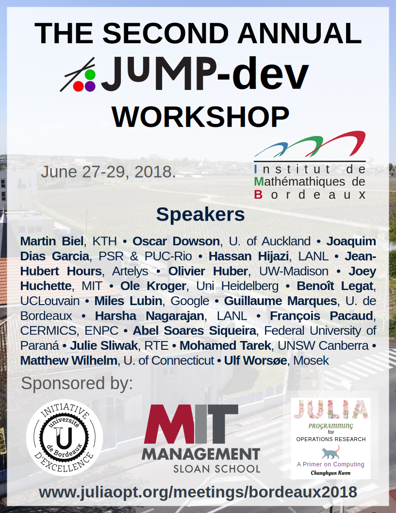

# The Second Annual JuMP-dev Workshop

June 27-29, 2018, at the Institut de Mathématiques de Bordeaux, University of Bordeaux.

## Purpose

This workshop is a follow-up to the [first annual JuMP-dev workshop](/meetings/mit2017/) held in June 2017 at MIT. The purpose of the workshop is to bring together students, researchers, and practitioners with interests in the software aspects of [JuMP](https://github.com/JuliaOpt/JuMP.jl) and related packages. Interest areas of the workshop include:

- JuMP core development ([MathOptInterface](https://github.com/JuliaOpt/MathOptInterface.jl), JuMP 1.0)
- Mathematical optimization solvers written in Julia
- Automatic differentiation in Julia (ReverseDiffSparse, ...)
- Julia interfaces to solvers
- JuMP extensions (stochastic programming, robust optimization, multiobjective optimization, ...)
- Optimization libraries that use JuMP
- Significant uses of JuMP in applications
- JuMP for teaching
- Developer tools for JuMP

The JuMP-dev workshop is a great opportunity to meet other people working on and around JuMP, as well as to provide feedback to the core JuMP team concerning its future direction. The workshop is scheduled to lead into [ISMP](https://ismp2018.sciencesconf.org).

  

## Location

The workshop will be held at the [Institut de Mathématiques de Bordeaux, University of Bordeaux](https://goo.gl/maps/PaeJbcRC58K2). There are options to stay in Talence (walking distance to JuMP-dev), or the Bordeaux city centre (short tram ride).

A variety of information about Bordeaux, as well as how to get there, and possible accommodation options, is available on the [ISMP conference website](https://ismp2018.sciencesconf.org).

## Call for participants

The workshop is open for anybody to attend. In particular, we invite new contributors and those who have not met the core development team.

The call for talks has now closed. However, if you wish to attend without giving a talk, **[use this form to indicate your participation](https://goo.gl/forms/tUeBUY6uAnAo8v5m2)**.

## Travel support

Thanks to the generous support of MIT Sloan School of Management, the JuMP-dev committee has funds available to provide travel support to a limited number of attendees. The deadline for travel support requests was May 15.

## Schedule

A preliminary schedule is outlined below. It will be updated once speakers are confirmed. The scheduled start of the workshop is at 13:30 on Wednesday, 27th June. This is to allow participants to arrive in Bordeaux on Wednesday morning.

### Wednesday 27 June

<tt>13:30 - 14:00</tt> Introduction **Juan-Pablo Vielma (MIT)**

<tt>14:00 - 14:25</tt> Systematically building mixed-integer programming formulations using JuMP and Julia **Joey Huchette (MIT)**

<tt>14:25 - 14:50</tt> Modeling decomposable Mixed Integer Programs **Guillaume Marques (Université de Bordeaux)**

<tt>14:50 - 15:15</tt> Coffee Break

<tt>15:15 - 15:40</tt> [Artelys Knitro](https://www.artelys.com/en/optimization-tools/knitro) 11.0, a new conic solver and other novelties **Jean-hubert Hours (Artelys)**

<tt>15:40 - 16:05</tt> Power and exponential Cones with [Mosek](https://www.mosek.com/) **Ulf Worsøe (MOSEK)**

<tt>16:05 - 16:30</tt> [ProxSDP.jl](https://github.com/mariohsouto/ProxSDP.jl): A semidefinite programming solver written in Julia **Joaquim Dias Garcia & Mario Souto (PUC-Rio)**

<tt>16:30</tt> Finish

### Thursday 28 June

<tt>10:00 - 10:25</tt> Stochastic Programming for Hydropower Operations: Modeling and Algorithms **Martin Biel (KTH - The Royal Institute of Technology)**

<tt>10:25 - 10:50</tt> Optimal energy management and stochastic decomposition **François Pacaud (CERMICS, ENPC)**

<tt>10:50 - 11:20</tt> Coffee Break

<tt>11:20 - 11:45</tt> A Julia JuMP-based module for polynomial optimization with complex variables applied to Optimal Power Flow  **Julie Sliwak (RTE)**

<tt>11:45 - 12:10</tt> [POD](https://github.com/lanl-ansi/POD.jl), A Global Solver for Nonconvex MINLPs **Harsha Nagarajan (LANL)**

<tt>12:10 - 13:30</tt> Lunch

<tt>13:30 - 14:05</tt> [The Gravity modeling language](https://www.allinsights.io/gravity) **Hassan Hijazi (LANL)**

<tt>14:05 - 15:00</tt> MathOptInterface and JuMP 0.19 **Miles Lubin (Google)**

<tt>15:00 onwards</tt> Discussion and unstructured collaboration time

<tt>Evening</tt> Workshop Dinner

*We are trying to arrange funding for the dinner, however if this is not possible, there may be a charge for participants.*

### Friday 29 June

<tt>10:00 - 10:25</tt> [Juniper](https://github.com/lanl-ansi/Juniper.jl): An Open-Source Nonlinear Branch-and-Bound Solver in Julia **Ole Kröger (LANL)**

<tt>10:25 - 10:50</tt> [NEOS.jl](https://github.com/odow/NEOS.jl): A Julia interface to the NEOS Server **Oscar Dowson (University of Auckland)**

<tt>10:50 - 11:20</tt> Coffee Break

<tt>11:20 - 11:45</tt> Automatic reformulation using constraint bridges **Benoît Legat (UCLouvain)**

<tt>11:45 - 12:10</tt> [EAGO](https://github.com/PSORLab/EAGO.jl): A Deterministic Nonconvex Optimization Package for Julia **Matthew Wilhelm (University of Connecticut)**

<tt>12:10 - 12:35</tt> [EMP.jl](https://github.com/xhub/EMP.jl), a package for modelling Extended Mathematical Programming **Oliver Huber (UW Madison)**

<tt>12:35 - 15:00</tt> Lunch and unstructured collaboration time

<tt>15:00 - 17:00</tt> JuMP Tutorial

The tutorial will cover how to use the new version of JuMP with [MathOptInterface](https://github.com/JuliaOpt/MathOptInterface.jl). The tutorial will be open to anyone, even if they have not attended the workshop. No JuMP experience is required.

<tt>17:00</tt> Finish

## Committee

- Miles Lubin (Google)
- Oscar Dowson (U. of Auckland)
- Benoît Legat (UCLouvain)
- Joaquim Garcia (PSR & PUC-Rio)
- Juan Pablo Vielma (MIT)
- Issam Tahiri (INRIA; Local Organization)
- François Vanderbeck (U. of Bordeaux; Local Organization)

Contact o.dowson at auckland.ac.nz or jump-dev-committee at googlegroups.com for more information.
